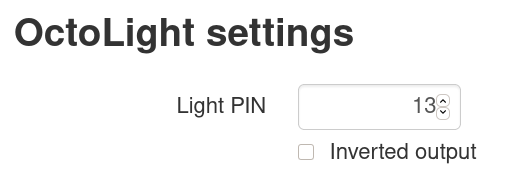

# OctoLight
A simple plugin that adds a button to the navigation bar for toggleing a GPIO pin on the Raspberry Pi.

## Setup
Install via the bundled [Plugin Manager](https://docs.octoprint.org/en/master/bundledplugins/pluginmanager.html)
or manually using this URL:

	https://github.com/gigibu5/OctoLight/archive/master.zip

## Configuration

Curently, you can configure two settings:
- `Light PIN`: The pin on the Raspberry Pi that the button controls. 
	- Default value: 13
	- The pin number is saved in the **board layout naming** scheme (gray labels on the pinout image below).
	- **!! IMPORTANT !!** The Raspberry Pi can only controll the **GPIO** pins (orange labels on the pinout image below)
	

- `Inverted output`: If true, the output will be inverted
	- Usage: if you have a light, that is turned off when voltage is applied to the pin (wired in negative logic), you should turn on this option, so the light isn't on when you reboot your Raspberry Pi.
	
## TO DO
- [ ] Update interface if Light is turned on or off

Maybe in the distant future:
- [ ] Turn off on finish print
